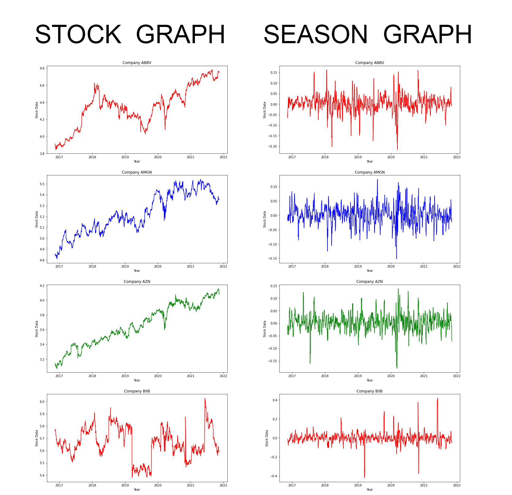
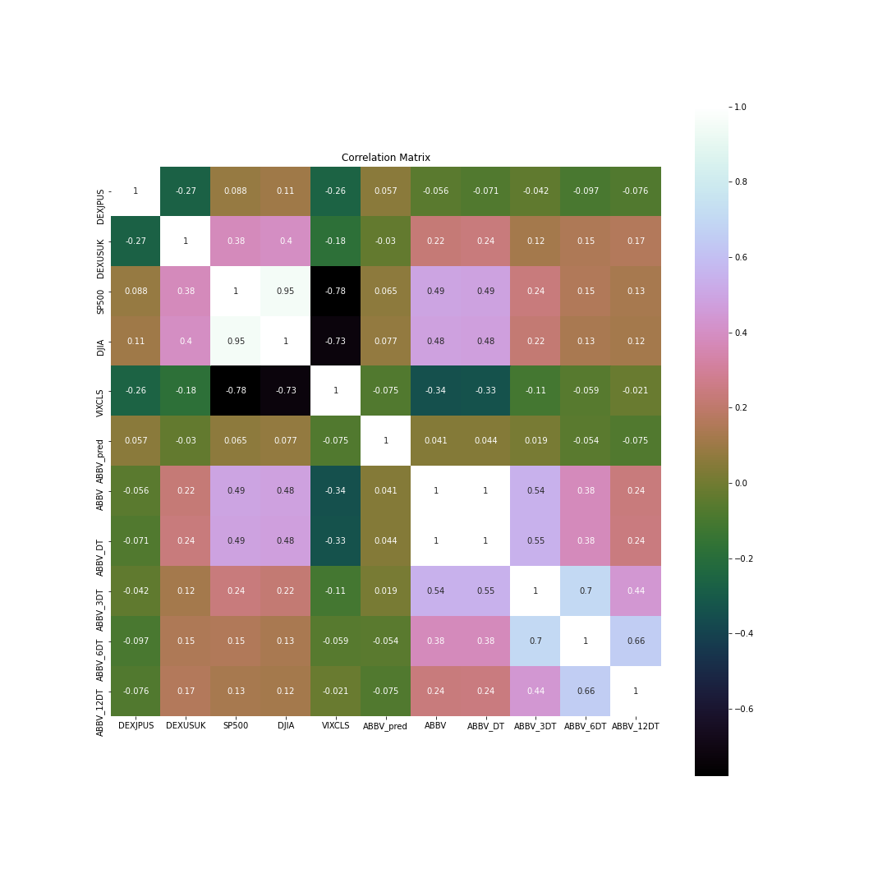
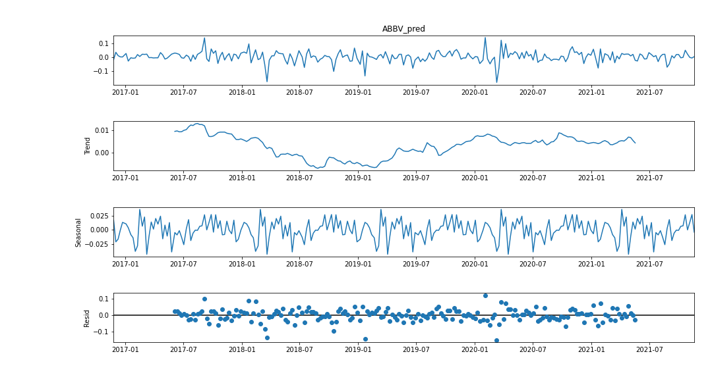
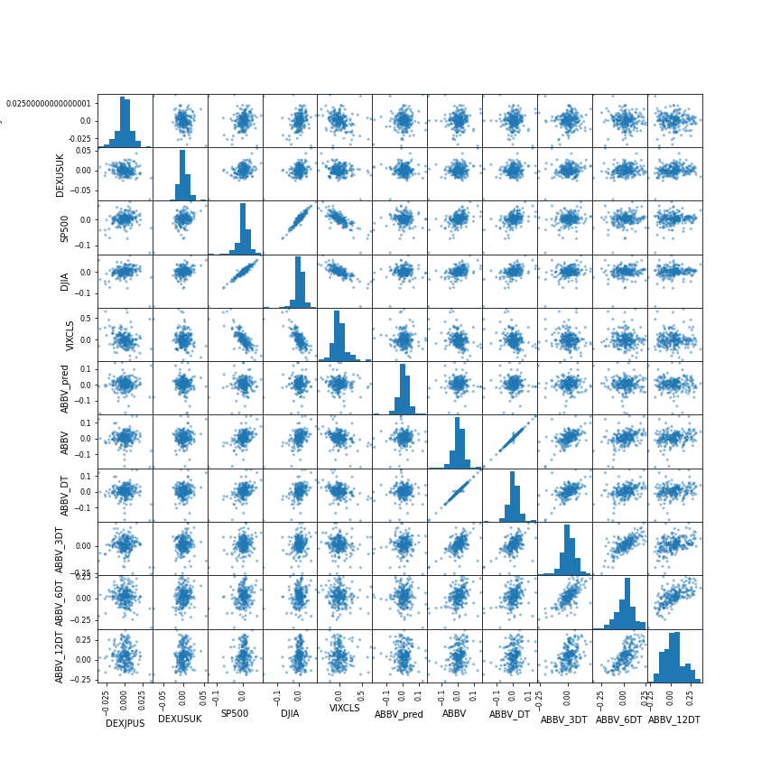
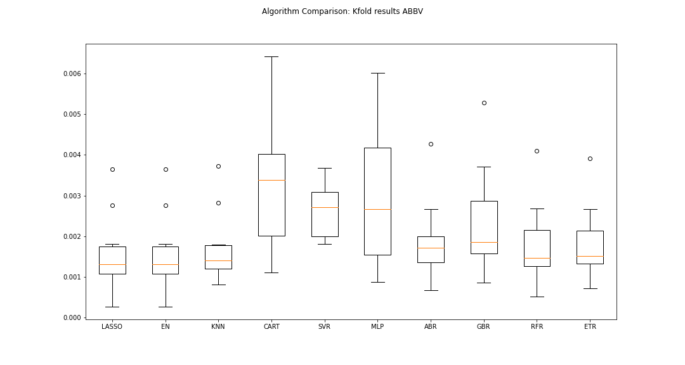
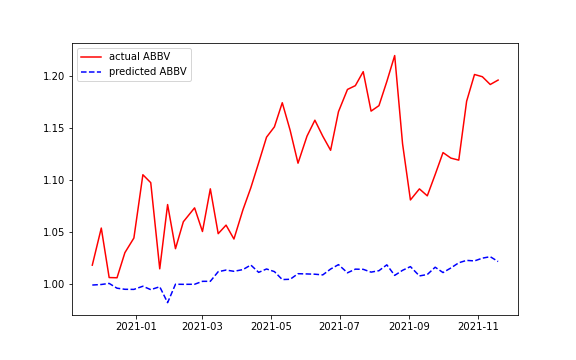
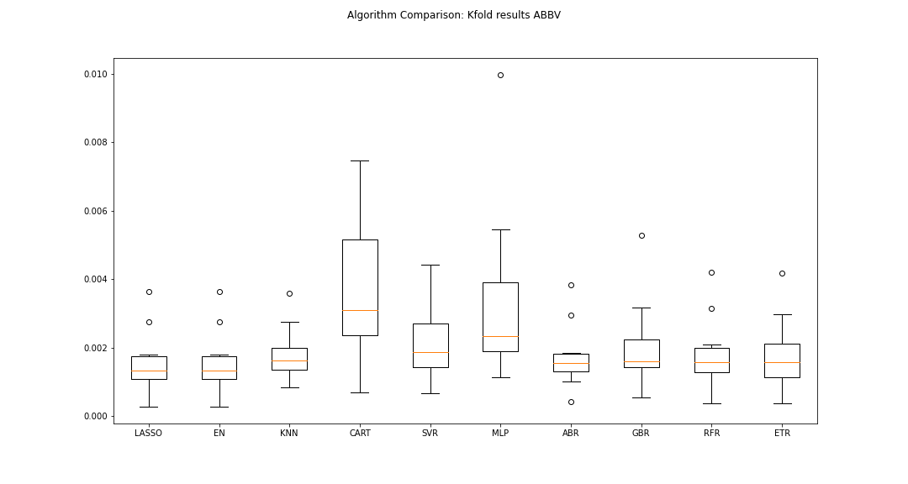
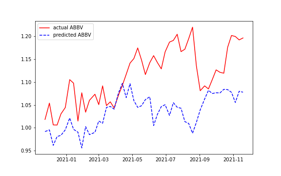

# STOCK MARKET PREDICTION:
## Topic
Using Yahoo Finance and the code obtained from the Towards Data Science [webpage](https://towardsdatascience.com/downloading-historical-stock-prices-in-python-93f85f059c1f) in order to scrape the information containing the stock data (Date, Open, High, Low, Close, Adj Close, Volume, Name), the topic that will be covered is to create a portfolio in order to suggest people or  companies to invest. By working on the data, the target is to create a model that helps predict possible ups and downs in the market using the historical stock prices.
The main reason to select this topic is that this data is real and will be of great use to polish skills and make something that will be useful for someone that wants to invert in the stock market, with this in mind we could have the chance to create a company that allows us to advise people or even companies about how to invest their money in the market with potential good results or even take a better decisions in our own investments.   
Using a time series model and machine learning models, specially Support Vector Machine and Artificial Neural Networks, the data will be tested and trained to try to accomplish a good percent of accuracy. For this, the data that will be used are samples taken in regular time intervals, with pandas, numpy and matplotlib, the time behavior can be observed. Also, it is important to note that Keras will be used and, a deeper research on exponential smoothing will be made.

# Presentation:
Using Google slides, the draft of the presentation is located [here](https://docs.google.com/presentation/d/1Kz56J1leuVfU7y-OmmQCwzDuR7-zNrtpLy_-yx1IieU/edit?usp=sharing). The slides presented there, are just showing some images, but notes were added in order to remind what that part is about. 

- *Selected topic*: Stock prices prediction.
- *Why that topic*: Create a model that predicts possible ups and downs in order to suggest investment.
- *Source of data*: Yahoo Finance
- *Questions to answer*: How to invest? Which are the best stock options?
- *Data exploration phase*: Scrap the data in order to know what it has.
- *Analysis phase*: data extraction, data exploration, check possible database to generate, data preprocessing, data training, ML models, predictors, dashboard dummy visualization.
 
## Github
A Github was created with the name of [Stock_market](https://github.com/LennethNova/Project_B) and each team member has a branch with their respective name in order to control the way the data will be uploaded.

## Machine Learning Model
For this data, different models will be used to test the accuracy. As previously mentioned in the *Topic* section, SVM, ANN and other models will be used to train and test the data. Libraries such as pandas, numpy and matplotlib will also be considered in this point, but the analysis will not be exclusive to the use of those since some others will be needed in order to accomplish the project.
The challenge is to get the best accuracy possible for the models and to make a good use of the code to get the expected results to make an accurate portfolio of the suggested investments.

During the preprocessing phase, the data for each company is shown in its individual stock graph and the second is referring to the stationality. This way it can be determined if the stock could depend on the season or if it will be random.

<!---->

## MODELS

### ARIMA
A popular and widely used statistical method for time series forecasting is the **ARIMA** model. *ARIMA* is an acronym that stands for *AutoRegressive Integrated Moving Average*. It is a class of model that captures a suite of different standard temporal structures in time series data.

The log transformation is often used to convert time series that are non stationary with respect to the innovation variance into stationary time series. As one alternative, you can simply exponentiate the forecast series. This procedure gives a forecast for the median of the series, but the antilog of the forecast log series underpredicts the mean of the original series. 

**Augmented Dickey Fuller test (ADF Test)** is a common statistical test used to test whether a given *time series is stationary or not*. It is one of the most commonly used statistical test when it comes to analyzing the stationary of a series. Dickey-Fuller test is a unit root test that tests the null hypothesis that α=1 in the following model equation. **alpha** is the coefficient of the first lag on Y.

**Null Hypothesis (H0):** alpha=1 The Augmented Dickey-Fuller test evolved based on the above equation and is one of the most common forms of Unit Root test.

**ARIMA** term refers to the past values used for forecasting the next value. The AR term is defined by the parameter "p" in *arima.p* is the number of autoregressive terms, the value of "p" is determined using the *PACF plot*. MA term is used to define the number of past forecast errors used to predict the future values. The parameter "q" in arima represents the MA term, "q" is the *number of lagged forecast errors* in the prediction equation. **ACF** plot is *used to identify the correct "q" value*. **d** is the* number of nonseasonal differences* needed for stationarity. Order of differencing  specifies the number of times the differencing operation is performed in series to make it stationary. 

**ARIMA(1,0,0)** = *first-order autoregressive*: if the series is stationary and autocorrelated, perhaps it can be predicted as a multiple of its own previous value, plus a constant.

**ARIMA(0,1,0)** = *random walk*: If the series is not stationary, the simplest possible model for it is a random walk model, which can be considered as a limiting case of an AR(1) model in which the autoregressive coefficient is equal to 1, i.e., a series with infinitely slow mean reversion. 

**ARIMA(1,1,0)** = *differenced first-order autoregressive model*: If the errors of a random walk model are autocorrelated, perhaps the problem can be fixed by adding one lag of the dependent variable to the prediction equation.

**ARIMA(0,1,1) without constant** = *simple exponential smoothing*: Another strategy for correcting autocorrelated errors in a random walk model is suggested by the simple exponential smoothing model. Recall that for some nonstationary time series (e.g., ones that exhibit noisy fluctuations around a slowly-varying mean), the random walk model does not perform as well as a moving average of past values.

**ARIMA(0,1,1) with constant** = *simple exponential smoothing with growth*: By implementing the SES model as an ARIMA model, you actually gain some flexibility. First of all, the estimated MA(1) coefficient is allowed to be negative: this corresponds to a smoothing factor larger than 1 in an SES model, which is usually not allowed by the SES model-fitting procedure. Second, you have the option of including a constant term in the ARIMA model if you wish, in order to estimate an average non-zero trend.ARIMA(0,2,1) or (0,2,2) without constant = linear exponential smoothing: Linear exponential smoothing models are ARIMA models which use two nonseasonal differences in conjunction with MA terms. 

**ARIMA(0,2,1) or (0,2,2) without constant** = *linear exponential smoothing*: Linear exponential smoothing models are ARIMA models which use two nonseasonal differences in conjunction with MA terms. 

**ARIMA(1,1,2) without constant** = *damped-trend linear exponential smoothing*:It extrapolates the local trend at the end of the series but flattens it out at longer forecast horizons to introduce a note of conservatism, a practice that has empirical support. 

### LSMT
**Long short-term memory (LSTM)** units are units of a recurrent neural network (RNN). An RNN composed of LSTM units is often called an LSTM network. A common LSTM unit is composed of a cell, an input gate, an output gate and a forget gate. The cell remembers values over arbitrary time intervals and the three gates regulate the flow of information into and out of the cell.

LSTM networks are well-suited to *classifying, processing and making predictions based on time series data*, since there can be lags of unknown duration between important events in a time series. LSTMs were developed to deal with the exploding and vanishing gradient problems that can be encountered when training traditional RNNs. Relative insensitivity to gap length is an advantage of LSTM over RNNs, hidden Markov models and other sequence learning methods in numerous applications.

<!---->

### Changes in models
The first attempt to analyze the data was using a code to scrap it and make it into a file in order to then clean it and process it. Using this method was slow and also some tickers were lost in the process, that is why it was decided to use the pandas-datareader according to the research that was made. After that change was made, the data cleaning was easier and it included all the tickers.

### Data preprocessing
There were changes that had to be made in order for the model to work, one of those was to tae every healthcare related ticker and scraping the data instead of saving it into a database in order for the models to work. ARIMA and LSTM are the ones that researching lead to use those models. Also, it is important to install python 3.6 in order for this code to run properly, if not, an error will occur while running the models.

#### Setting the envionment
To run the model, the environment code in anaconda is as follows:
- conda update conda
- Proceed: y
- conda create -n mlenvi python=3.6 anaconda
- Proceed: y
- conda activate mlenvi
- pip install environment_kernels
- conda install -c conda-forge imbalanced-learn
- Proceed: y
- python -m ipykernel install --user --name mlenvi
- pip install --upgrade tensorflow

Also, the pandas datareader must be installed with pip install pandas-datareader. This will allow the data extraction from different internet sources (in this case Yahoo Finance), and make it a dataframe.

#### Running the model
ARIMA and LSTM are optimized for this kind of data due to their respective properties because both models help with the forecast and also, since the project involves time, those two models were what some research pointed to use.

### Data preprocessing
There were changes that had to be made in order for the model to work, one of those was to tae every healthcare related ticker and scraping the data instead of saving it into a database in order for the models to work. ARIMA and LSTM are the ones that researching lead to use those models.

ARIMA and LSTM are optimized for this kind of data due to their respective properties.

During the data gathering, yahoo finance was used using a scraper function in order to obtaing the ticker information. During this scraping, the money exchange that was used is Yen to US dollar and US dollar to UK currency. The indexes that were considered were The Standard and Poor's 500 (SP500), Dow Jones Industrial Average (DJIA) and the Volatility Index (VIXCLS). These were suggested in the book *Machine Learning and Data Science Blueprints for Finance: From Building Trading Strategies to Robo-Advisors Using Python (1st ed.)*. Training and testing was divided in 80% to 20%.

After collecting the respective data, the data was inspected in order to check what it was offering in order to get the training and testing information sets. The columns with the date, adjusted close and the ticker name were selected for the analysis. The Y variable is considered to be the weekly performance in time plus one, while the period will be five to make it supervised. 

To analyze the data, it is important to check if the seasonality applys to it in order to give a better predictor in Y. This will be shown in the images by ticker name.

The X training and testing set have the lag by week, 3 weeks, 6 weeks and 12 weeks for a better visualization.

It is important to note that all NaN data in X mush be removed and if anything still remains the SimpleImputer with *mean* will substitute the data in order to fill that null spaces that will normally be filled. This is only applied to the necessary data. In the dataset, the data that will be there is related to just weeks and has a start, finish and a leap leaving 225 observations since the model is only considering 52 weeks.

A correlation matrix is shown with all and also by individual tickers. Unfortunately, the scatter matrix is too heavy for the current computer to run, but individuals are shown. 

In order to test the models, eash ticker was run individually and showed poor performance at predicting even with ARIMA or LSTM, but after testing the second time for each ticker versus all, the predictions improved drastically.

The accuracy for this model increases by using more tickers, knowing this, testing a with more will probably make the model accurate. Also, as previously stated, the model is only considering 52 weeks, but increasing weeks could also lead to a best result.

## Database
The dataset, as mentioned previously in the *Topic* section has the next content:
- Stock symbol
- Date
- Open
- High
- Low
- Closing
- Adjusting Closing price
- Volume traded

 
## Dashboard
Visit the [Dashboard](https://public.tableau.com/app/profile/alejandra.s.nchez.del.moral/viz/stockAnalysis_Dashboard/General?publish=yes)

# References
José Alberto Mauricio. (n.d.). Introducción al Análisis de Series Temporales. Universidad Complutense De Madrid. Retrieved November 14, 2021, from https://www.ucm.es/data/cont/docs/518-2013-11-11-JAM-IAST-Libro.pdf

Understanding LSTM Networks. (2015, August 27). Colah’s Blog. Retrieved November 14, 2021, from https://colah.github.io/posts/2015-08-Understanding-LSTMs/

Tatsat, H., Puri, S., & Lookabaugh, B. (2020). Machine Learning and Data Science Blueprints for Finance: From Building Trading Strategies to Robo-Advisors Using Python (1st ed.). O’Reilly Media.